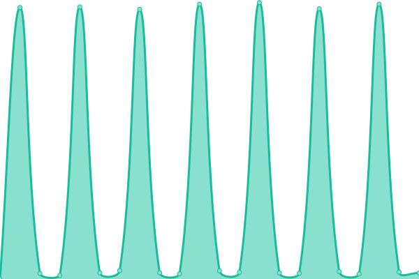
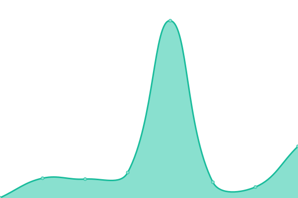

# [📈 Live Status](https://demo.upptime.js.org): <!--live status--> **🟩 All systems operational**

<!--start: status pages-->
<!-- This summary is generated by Upptime (https://github.com/upptime/upptime) -->
<!-- Do not edit this manually, your changes will be overwritten -->
<!-- prettier-ignore -->
| URL | Status | History | Response Time | Uptime |
| --- | ------ | ------- | ------------- | ------ |
|  [BFC Auth](https://bfcgroup.ph) | 🟩 Up | [bfc-auth.yml](https://github.com/mrunknown0001/status/commits/HEAD/history/bfc-auth.yml) | 

 7101ms
     
 | 

<a href="https://status.bfcgroup.ph/history/bfc-auth">66.22%</a>
    

|  [BFC Group Website](https://brooksidegroup.org) | 🟩 Up | [bfc-group-website.yml](https://github.com/mrunknown0001/status/commits/HEAD/history/bfc-group-website.yml) | 

 6935ms
     
 | 

<a href="https://status.bfcgroup.ph/history/bfc-group-website">71.17%</a>
    

|  [SMD Dev](https://smd-dev.bfcgroup.ph) | 🟩 Up | [smd-dev.yml](https://github.com/mrunknown0001/status/commits/HEAD/history/smd-dev.yml) | 

 2020ms
     
 | 

<a href="https://status.bfcgroup.ph/history/smd-dev">100.00%</a>
    

|  [Wikipedia](https://en.wikipedia.org) | 🟩 Up | [wikipedia.yml](https://github.com/mrunknown0001/status/commits/HEAD/history/wikipedia.yml) | 

 228ms
     
 | 

<a href="https://status.bfcgroup.ph/history/wikipedia">100.00%</a>
    

<!--end: status pages-->

## 📄 License

- Powered by: [Upptime](https://github.com/upptime/upptime)
- Code: [MIT](./LICENSE) © [Anand Chowdhary](https://anandchowdhary.com), supported by [Pabio](https://pabio.com)
- Data in the `./history` directory: [Open Database License](https://opendatacommons.org/licenses/odbl/1-0/)
